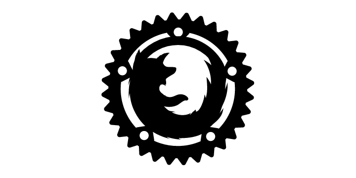
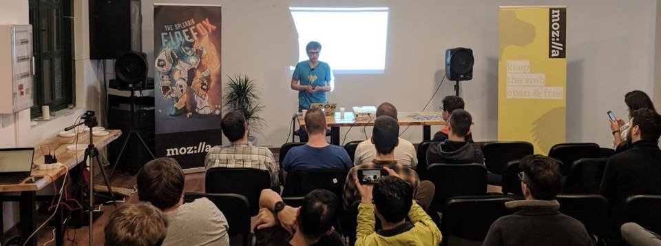

# Idén utoljára Novemberben Rust Hungary meetup Budapesten

Három a magyar igazság, szól a mondás: az igazság pedig az hogy bizám máris
elérkezett a harmadik Rust Hungary meetup, ahogy arra számíthattatok, kiváló
lineuppal és előadásokkal készültünk nektek borongós késő-őszi csütörtök estékre. ;)

**[Rust Hungary #3 - November 23., Csütörtök 18:00](https://www.meetup.com/Rust-Hungary-Meetup/events/244411460/)**

Első előadónk ezúttal is a Mozillától érkezik, Stockholmból: Valentin Gosu
a múlt heti meglehetősen zajos [Firefox Quantum release](https://blog.mozilla.org/blog/2017/11/14/introducing-firefox-quantum/) kulisszatitkairól valamint a kezdetekről fog mesélni—azaz arról mit is keres a Rust a Firefoxban és az útról ami ahhoz vezetett hogy az első Rust
komponensek immáron bekerültek a mindenki által elérhető stabil böngészőverzióba is.

Őt követi majd Jan-Erik Rediger aki nem kevésbé izgalmas témával foglalkozik majd,
mégpedig a WebAssembly kérdésével. A nyitómeetupunkon már szó esett erről egyszer,
Jan-Erikkel most kicsit jobban elmélyedünk a technológia kínálta lehetőségekben.

Harmadik előadónk ezúttal is helyi illetőségű, a Rust Hungary meetup-sorozat
egyik alapító tagja, Czibik Péter fog arról beszélni hogyan használhatjátok
fel akár már ma Rust tudásotokat node.js környezetben, akár éles projekteken is.

**[Nikita Baksalyar előadása az októberi Rust Hungary meetupról](https://twitter.com/RustHungary/status/922892563228610561)**

Szóval tartsatok velünk ezúttal is, megéri - részletes leírást az előadókról/előadásokról
ahogyan eddig is, [a meetup.com-on találtok](https://www.meetup.com/Rust-Hungary-Meetup/events/244411460/)
és itt tudtok feliratkozni is a meetupra.

A Rust Hungary meetup-sorozat a November 23.-i meetup után téli álomba szenderül, legközelebb 2018-ban találkozhattok velünk, de Decemberben is meg akarjátok kapni a havi open-source-adagotokat gyertek el az év utolsó [Open Source Budapest meetupjára](https://www.meetup.com/opensourcebudapest/)!

---

# Year-ending Rust Hungary Meetup in Budapest in November

Third time is a charm, they say—so we have prepped you all a charming late-fall Rust Hungary Meetup number three to keep you cozy and well-rusted in drizzly and chilly late fall Thursday evenings. ;)

**[Rust Hungary #3 - Thursday 23. November 18:00](https://www.meetup.com/Rust-Hungary-Meetup/events/244411460/)**

Our first presenter comes again from Mozilla, straight from Stockholm! For anyone working on the web these days, there is a high chance last week's roaring [Firefox Quantum release](https://blog.mozilla.org/blog/2017/11/14/introducing-firefox-quantum/) has caught your ears. Valentin Gosu will show us how it all started, how the first bits of Rust landed in Firefox and the monumental work that led up to Rust components shipping in the live production version of the newest Firefox for anyone out there to see.

The next presenter, Jan-Erik Rediger will be covering a no-less exciting technology: we have already had a presentation about WebAssembly on our first meetup, Jan-Erik will be diving a bit more into the capabilities and possibilities of the technology today.

Our third speaker, as usual, is from the region: Peter Czibik, one of the founding organizers of the Rust Hungary meetup-series will be talking about using Rust in node.js applications today, taking advantage of what Rust can offer, even possibly in one's production projects.

**[Nikita Baksalyar talks at the Rust Hungary meetup in October](https://twitter.com/RustHungary/status/922892563228610561)**

Needless to say, join us again, it will be worth it! Detailed talk descriptions and RSVP-s [are on our meetup.com page](https://www.meetup.com/Rust-Hungary-Meetup/events/244411460/) as usual.

The Rust Hungary meetup series will go into hibernation after our November 23. meetup, we will be returning in 2018, but to get your monthly open-source-fix in next month too, check out this year's last [Open Source Budapest meetupjára](https://www.meetup.com/opensourcebudapest/) in December!
